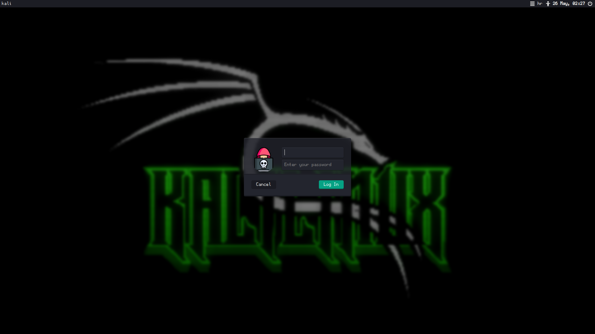
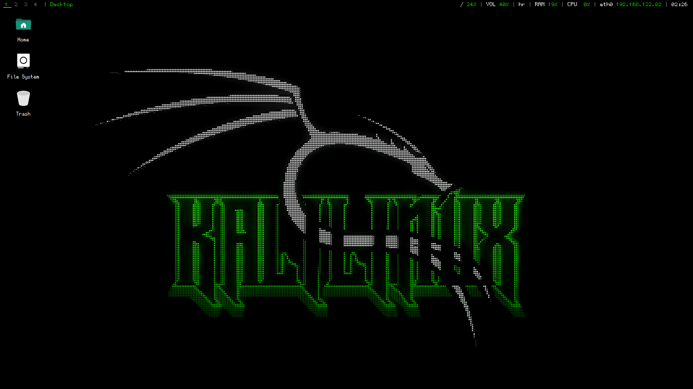
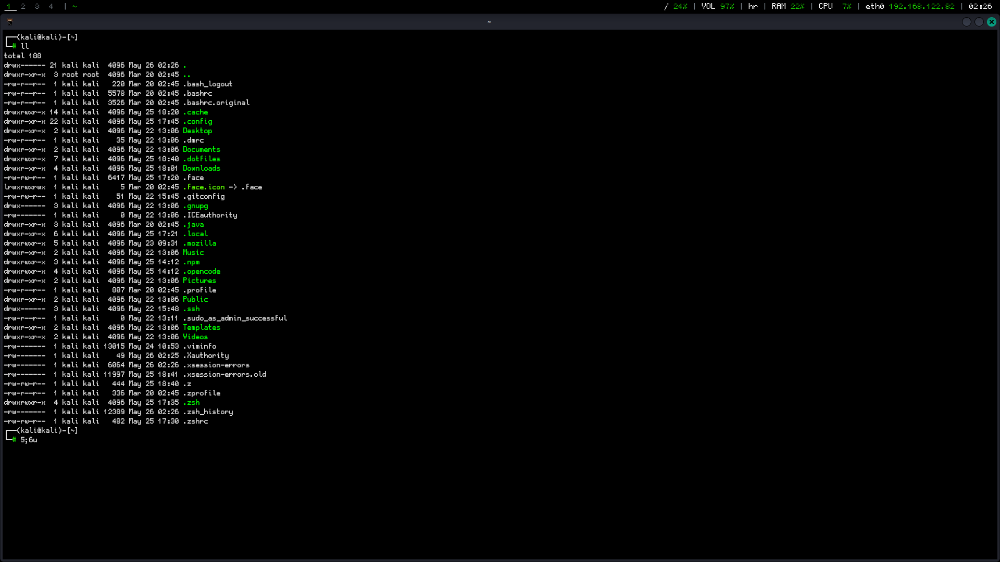

# Kalipimp

Pimp the shit out of Kali with `pimp.sh`

Run `bash pimp.sh`

## Screenshots

*Grub*:

*Plymouth*:

*Login*:

*Desktop*:

*Terminal*:

## Credits

- Gohu Font: [hchargois/gohufont](https://github.com/hchargois/gohufont)
- Darkmatter: [VandalByte/darkmatter-grub2-theme](https://github.com/VandalByte/darkmatter-grub2-theme)
- Plymouth Themes: [adi1090x/plymouth-themes](https://github.com/adi1090x/plymouth-themeshttps://github.com/adi1090x/plymouth-themes)
- Pfp: [Incognito icons created by Freepik - Flaticon](https://www.flaticon.com/free-icons/incognito)
